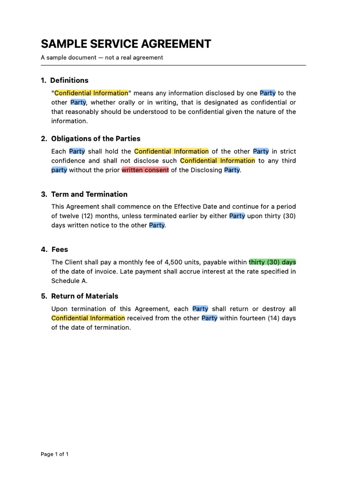
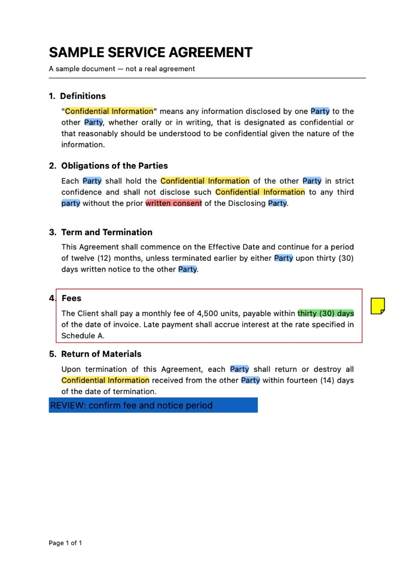
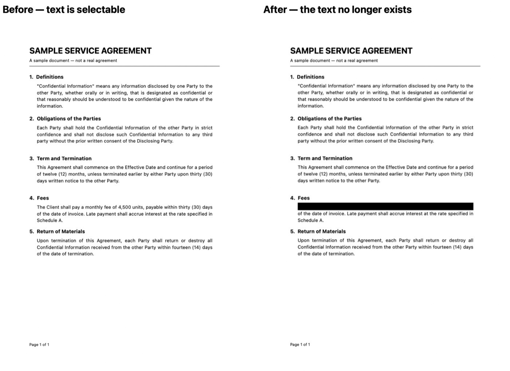
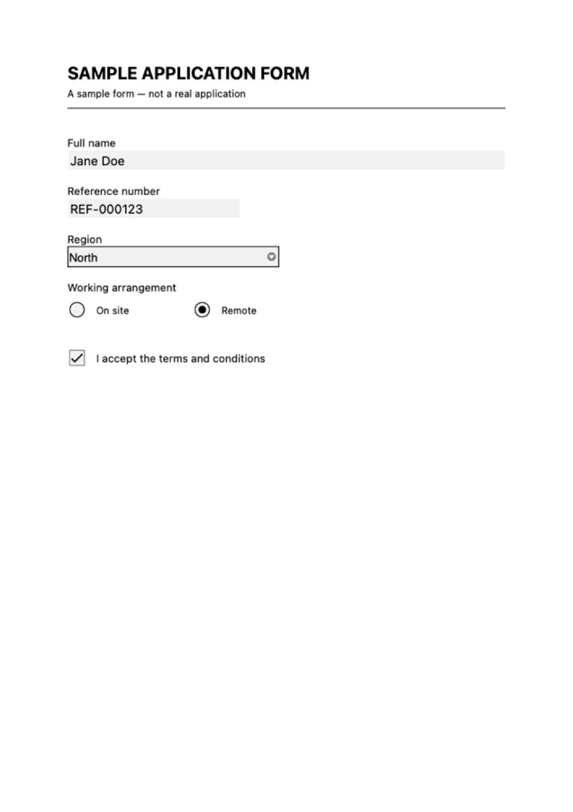

<p align="center">
  
</p>

<h1 align="center">apple-pdf-mcp</h1>

<p align="center">
  Let Claude work with your PDFs the way you would in Preview — read, search,<br>
  annotate, fill forms, encrypt and redact.
</p>

<p align="center">
  A local MCP server for macOS, written in Swift on Apple's own PDFKit.<br>
  <em>No network. No Finder. No Apple events. Nothing leaves your Mac.</em>
</p>

<p align="center">
  <a href="https://github.com/eneko-codes/apple-pdf-mcp/actions/workflows/ci.yml"></a>
  
  
  
</p>

---

## See it work

**Highlight every mention of a term, in any colour.** One call per colour, layered up:



**Add notes, boxes, circles and text to a page:**



**Redact for real.** Not a black rectangle over words that are still in the file — the text is
*destroyed*. Search the result and it finds nothing; even raw byte inspection turns up nothing:



**Fill in a form** — text fields, dropdowns, radio buttons and checkboxes:



---

## What this is

An MCP server giving Claude **16 tools** for working with PDFs on your Mac. It ships as a
Claude extension: install it, choose which folders Claude may touch, done.

Everything runs through **PDFKit** — the same framework Preview uses. No PDF parsing of its
own, no third-party library, no network access of any kind.

Two properties shape how it behaves:

- **It never edits your file.** Every tool that changes something writes a **new** file at a
  path you choose. Your original is untouched, always.
- **You decide what it can reach.** Two independent folder lists — one to read, one to write
  into. Being able to read a folder does not mean it can write there.

---

## Tools

Arguments in `code` are required, `?` marks optional. Every writing tool also takes
`output_path`.

### Reading

| Tool | What it does | Arguments | Metadata |
|---|---|---|---|
| **`pdf_status`** | Shows which folders it may read and write, and whether macOS is actually allowing it. Start here when something is refused. | — | — |
| **`pdf_read`** | Pulls out the text page by page, plus bookmarks and document info. Says plainly when a PDF is a scan instead of returning blank pages. | `path`, `first_page?`, `last_page?`, `outline_query?`, `include_outline?`, `password?` | Reported; long values trimmed at 400 characters |
| **`pdf_search`** | Finds every occurrence of a phrase, with the whole line it sits on. Ignores case and accents, and still matches when the document breaks the phrase across two lines. | `path`, `query`, `case_sensitive?`, `accent_sensitive?`, `password?` | Not touched |
| **`pdf_list_annotations`** | Lists highlights, notes, shapes and links already on a PDF, with position and author. | `path`, `password?` | Not touched |
| **`pdf_list_form_fields`** | Lists a form's fields — name, type, current value, whether it is locked. Call this before filling anything. | `path`, `password?` | Not touched |

### Writing

Each writes a new file and leaves the source alone.

| Tool | What it does | Arguments | Metadata |
|---|---|---|---|
| **`pdf_merge_pages`** | Combines files, reorders pages, extracts a selection, or drops pages — all four jobs, depending on what you pass. | `sources` (list of `path` + `pages?`) | ⚠️ **Starts blank** — set it again afterwards |
| **`pdf_rotate_pages`** | Turns individual pages by 90°, 180° or 270°. | `path`, `rotations` (list of `page` + `degrees`) | Preserved |
| **`pdf_highlight_text`** | Searches for a phrase and highlights every hit, following the text across line breaks. The easy way to mark up a document. | `path`, `query`, `color?`, `case_sensitive?`, `accent_sensitive?` | Preserved |
| **`pdf_add_annotation`** | Places one annotation: highlight, underline, strike-through, sticky note, text box, rectangle or ellipse. | `path`, `page`, `kind`, `x`, `y`, `width`, `height`, `contents?`, `color?`, `interior_color?` | Preserved |
| **`pdf_remove_annotation`** | Deletes one annotation, addressed as `pdf_list_annotations` reports it. | `path`, `page`, `index` | Preserved |
| **`pdf_fill_form`** | Fills form fields by name. `flatten` locks the answers in permanently. | `path`, `fields` (name → value), `flatten?` | Preserved |
| **`pdf_set_password`** | Encrypts the file: a password to open it, and/or permissions controlling printing and copying. | `path`, `user_password?`, `owner_password?`, `permissions?` | Preserved |
| **`pdf_remove_password`** | Produces a genuinely decrypted copy. Refused if the password is wrong. | `path`, `password` | Preserved |
| **`pdf_set_metadata`** | Sets title, author, subject and keywords. | `path`, `title?`, `author?`, `subject?`, `keywords?` | **You set it**; omitted fields keep their value |
| **`pdf_render_page`** | Saves one page as a PNG — the only tool that works on a scan. | `path`, `page`, `scale?` | — (writes an image) |
| **`pdf_redact_pages`** | Permanently removes content in the rectangles you give. See the warning below. | `path`, `regions` (list of `page` + `rects`), `scale?` | Preserved |

> **About that Metadata column.** Most tools carry title, author and keywords across
> untouched. **`pdf_merge_pages` is the exception** — it builds a genuinely new document, so
> the result has no title, author or keywords at all. Extract three sections to send to
> someone and the file arrives anonymous unless you run `pdf_set_metadata` afterwards.

---

## Four things worth knowing

**Your originals are never modified.** Every change goes to a new file at the `output_path`
you name. Nothing is edited in place, ever.

**Reading a folder does not mean writing to it.** Two separate lists. You might let Claude
read all of `~/Documents` but write only into one output folder. Leave the write list empty
and the server is read-only — every editing tool politely refuses.

**A scanned PDF is reported, not guessed at.** If a document is photographs of pages with no
real text, `pdf_read` says so instead of handing back 34 blank pages. Reading a scan means
text recognition, which this server does not do — but `pdf_render_page` still works on it.

**Redaction is real, and it costs you the page's text.** A black box painted over words leaves
those words in the file, where anything ignoring draw order pulls them straight back out. So
`pdf_redact_pages` flattens the whole page to an image instead. The words genuinely cease to
exist — and so does the rest of that page's searchable text. **Redact last**, once you have
finished searching and highlighting.

---

## Install

**There is no download.** You build it yourself, and that is on purpose — macOS ties a
folder permission to the signature on the binary, so a build signed by someone else would
hand you a grant you cannot renew, and an unsigned one would re-ask on every update. Signing
locally with your own identity is what makes the permission stick.

Needs an Apple silicon Mac on macOS 26+, Xcode 26, and a code-signing identity. Ad-hoc
signing works too, but then macOS re-asks for folder permission on every rebuild. See what
you have with `security find-identity -v -p codesigning`.

### 1. Build it

```bash
MCPB_SIGN_IDENTITY="Apple Development: Your Name (TEAMID)" ./scripts/pack.sh
```

Produces `dist/apple-pdf-mcp.mcpb`. The script checks its own work and fails loudly rather
than shipping something that would silently refuse to run.

### 2. Install it

Open `dist/apple-pdf-mcp.mcpb` with Claude, then **quit Claude completely (⌘Q) and reopen
it**. Installing does not replace a server that is already running — skip this and the old
version keeps answering.

### 3. Choose the folders

In **Claude → Settings → Extensions → PDF**:

| Setting | |
|---|---|
| **Folders Claude may read** | Required. Nothing outside these is reachable. |
| **Folders Claude may write** | Optional. Leave blank to keep everything read-only. |

Neither has a default. An unconfigured install reaches nothing, deliberately.

### 4. Grant macOS permission

The first time a tool touches Desktop, Documents or Downloads, macOS asks — say yes. Anywhere
else, such as iCloud Drive or an external disk, needs **Full Disk Access**, granted by hand in
System Settings with no prompt.

Run `pdf_status` to confirm. If no permission dialog ever appears, the binary lost its
embedded `Info.plist`:

```bash
otool -P extension/server/apple-pdf-mcp | grep UsageDescription
```

---

## Turning tools on and off

Every tool has its own switch in **Settings → Extensions → PDF**. Turn off anything you would
rather Claude could not do — switch off all the writing tools and it becomes a reader.

**Reinstalling can reset these switches**, so check them after each update.

---

## Known limits

- **No OCR.** A scan is reported as having no text layer; nothing here reads pixels as text.
- **No digital signatures.** Public PDFKit has no API for a real CMS/PKCS7 signature, so there
  is no signing tool at all rather than one that pretends. `pdf_fill_form` skips signature
  fields instead of writing something meaningless into them.
- **Redaction flattens the whole page**, not just the boxes — that page stops being searchable.
- **No freehand ink, lines or image stamps.** None has a shape you could sensibly describe as
  a tool argument, so none is offered half-working.
- **`pdf_merge_pages` drops document metadata**, since it builds a new file. Set it again after.
- **A sticky note is two entries.** PDFKit pairs a `Text` annotation with a `Popup` holding a
  copy of the same words, and `pdf_list_annotations` shows both. `pdf_remove_annotation`
  deletes the pair together, matching them by contents — so two notes with *identical* text on
  one page would lose both popups and keep both notes.
- **Placing annotations by coordinate is only as good as your coordinates.** For text you can
  name, `pdf_highlight_text` finds it exactly. Save `pdf_add_annotation` for shapes and notes.

---

## Frameworks and APIs

| Used | For | Reference |
|---|---|---|
| PDFKit — `PDFDocument`, `PDFPage`, `PDFAnnotation`, `PDFSelection`, `PDFOutline`, `PDFDestination` | Every read and write, including `PDFDocumentWriteOption` and `PDFAccessPermissions` for passwords and permissions | [PDFKit](https://developer.apple.com/documentation/pdfkit) |
| Core Graphics — `CGContext`, `CGColorSpace` | Rasterising a page for `pdf_render_page` and `pdf_redact_pages` | [Core Graphics](https://developer.apple.com/documentation/coregraphics) |
| AppKit — `NSImage`, `NSBitmapImageRep`, `NSColor` | Turning a rendered page into PNG | [AppKit](https://developer.apple.com/documentation/appkit) |
| Foundation `FileManager` | Path scope checks and writing output | [FileManager](https://developer.apple.com/documentation/foundation/filemanager) |

PDFKit offers more: the whole `PDFAction` family (link targets, form resets, remote go-to),
`PDFBorder` and `PDFAppearanceCharacteristics`, and the view layer — `PDFView`,
`PDFThumbnailView`, `PDFPageOverlayViewProvider` — which a stdio server has no use for. There
is no public PDFKit API for a CMS/PKCS7 signature, which is why no signing tool exists here.
Vision is not linked: this server never reads pixels as text.

---

## Development

```bash
swift build
swift test
```

61 tests across four suites — `PathScopeTests`, `CatalogueTests`, `DispatchTests` and
`FormatTests` — all against a modelled scope and a recording double, **never a real file**.
`StubStore` throws from every method except `canonicalise`, so a scope test that accidentally
reached a real file fails loudly instead of quietly passing. That is also why the suite runs
unchanged in CI on a fresh `macos-26` runner: it needs no documents, no folder permissions and
no signing identity.

CI additionally runs `scripts/pack.sh` itself, which is the only way to check what the tests
cannot: that the embedded `Info.plist` survives both linking and signing (without it macOS
denies folder access with no prompt at all), that the binary is not left linker-signed, that
the archive keeps its executable bit, and that the version agrees across `manifest.json`,
`Info.plist` and `Server.swift`. The bundle it uploads is ad-hoc signed and meant for
inspection, not for installing.

**The security boundary lives in one small file.** `PathScope` turns a string into a
`ScopedPath` (for reading) or a `WriteScopedPath` (for writing), or refuses. Both initialisers
are `fileprivate` to that file, so nothing else can mint one: forgetting the check is a
compile error, and a read-scoped path cannot be passed where a write destination is required.

Paths are canonicalised **before** they are compared — `~` expanded, `..` removed, symlinks
resolved — because comparing the raw string would let `~/Documents/../../../etc` pass a prefix
test while landing somewhere else entirely. Containment is checked by path component, so
`Documents-private` is never mistaken for something inside `Documents`.

`CLAUDE.md` carries the rules for anyone — human or agent — working in this repository.

### Running it without the extension

```json
{
  "mcpServers": {
    "PDF": {
      "command": "/absolute/path/to/apple-pdf-mcp/.build/release/apple-pdf-mcp",
      "args": [
        "--read-roots", "/Users/you/Documents",
        "--write-roots", "/Users/you/Documents/PDF Output"
      ]
    }
  }
}
```

You lose the per-tool switches, and both scopes must be passed by hand. Omit `--write-roots`
to keep it read-only.

### Distributing a build

```bash
MCPB_HARDENED=1 MCPB_SIGN_IDENTITY="Developer ID Application: …" ./scripts/pack.sh
```

Adds the hardened runtime and a secure timestamp, which notarisation requires. This server
sends no Apple events and needs no entitlements file.

---

## Licence

MIT. Not affiliated with or endorsed by Apple Inc.
